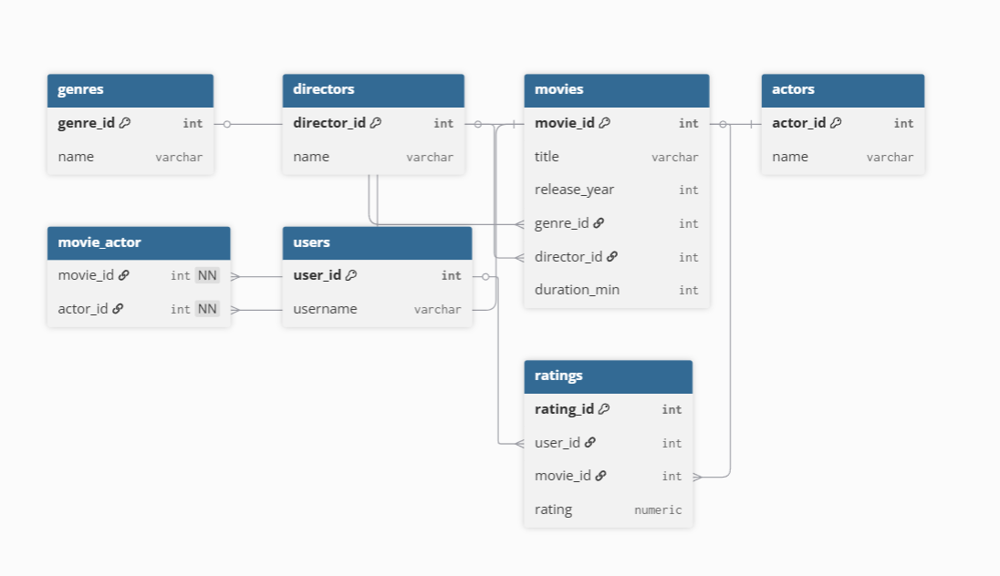

# 🎬 CineAnalytics

**Company Name:** CineAnalytics  
**Role:** Data Analyst  

## 📌 Project Overview
CineAnalytics is a fictional analytics company exploring trends in the global movie industry.  
This project shows a complete data-analysis pipeline:

- **Relational database design** (PostgreSQL)
- **CSV data import** directly from Python
- **Pre-written SQL queries** for insights
- **Automatic execution** of all queries and formatted output

---

## 🗂️ Database Schema


**Tables**
- **movies**: Basic movie info (title, year, duration, etc.)
- **genres**: List of genres
- **directors**: Movie directors
- **actors**: Actors list
- **movie_actor**: Many-to-many link between movies and actors
- **users**: Application users
- **ratings**: User ratings for movies

---

## 🚀 How to Run

### 1️⃣ Requirements
- **Python 3.10+**
- **PostgreSQL 15+**
- Install dependencies:
  ```bash
  pip install -r requirements.txt
  ```

### 2️⃣ PostgreSQL Setup
Create the database:
```bash
createdb movies_db
```

Make sure you know your PostgreSQL username/password.  
Update them in main.py if different from:
```python
user="postgres"
password="postgres"
```

### 3️⃣ Project Structure
```
movies_project/
│
├─ data/                # CSV files: genres.csv, directors.csv, ...
├─ queries.sql          # 10 analytical SQL queries with comments
├─ images/
│   └─ er_diagram.png   # ER diagram
├─ main.py              # Single Python script to build DB and run queries
└─ requirements.txt
```

### 4️⃣ Run the Script
From the project root:
```bash
python main.py
```

The script will:
- Create tables in movies_db
- Load CSV data into all tables (casting to native Python types to avoid psycopg2 errors)
- Read queries.sql, print each query description, execute it, and display results as tables

---

## 🧩 Key Files

- **main.py** – End-to-end pipeline: create schema, import data, run queries
- **queries.sql** – 10 analytical SQL queries with comments; descriptions are printed by main.py
- **data/\*.csv** – Raw datasets for each table
- **images/er_diagram.png** – Entity-relationship diagram

---

# Enjoy exploring the movie data! 🍿